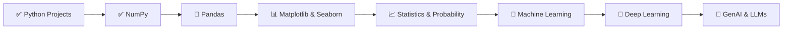

<p align="center">
  
</p>

<h1 align="center">📊 Data Science & Analytics with GenAI — Learning Journey</h1>

<p align="center">
  <em>A comprehensive, daily-updated repository documenting my complete learning path through the <strong>Data Science and Analytics with GenAI</strong> course — from Python fundamentals to real-world projects.</em>
</p>

<p align="center">
  
  
  
  
  
</p>

<p align="center">
  
  
  
  
</p>

<p align="center">
  
  
  
  
</p>

---

## 📑 Table of Contents

- [🧭 About](#-about)
- [🎯 Learning Objectives](#-learning-objectives)
- [📂 Folder Structure](#-folder-structure)
- [📘 Topics Covered](#-topics-covered)
- [📁 Folder Descriptions](#-folder-descriptions)
- [🛠️ Technologies Used](#️-technologies-used)
- [📚 Libraries Used](#-libraries-used)
- [📓 Notebooks Guide](#-notebooks-guide)
- [🚀 Projects](#-projects)
- [📅 Daily Progress Timeline](#-daily-progress-timeline)
- [📊 Learning Progress](#-learning-progress)
- [🏅 Skills Gained](#-skills-gained)
- [✨ Repository Highlights](#-repository-highlights)
- [❓ Why This Repository](#-why-this-repository)
- [🗺️ Future Learning Roadmap](#️-future-learning-roadmap)
- [🤝 Contributing](#-contributing)
- [📄 License](#-license)
- [🙏 Acknowledgements](#-acknowledgements)
- [📬 Contact](#-contact)

---

## 🧭 About

This repository is a **living document** of my ongoing learning journey through the **"Data Science and Analytics with GenAI"** course. I push my code, notebooks, notes, and projects daily as I progress through each topic.

The repository spans everything from the **foundations of NumPy and Pandas** to **hands-on Python projects** built with real-world architecture — including CLI applications, Streamlit-powered web apps, and game development using scientific computing libraries.

> 💡 **This is not just coursework — it's a portfolio of applied learning, built one day at a time.**

---

## 🎯 Learning Objectives

| # | Objective | Status |
|---|-----------|--------|
| 1 | Master **NumPy** for numerical computing and array manipulation | ✅ Completed |
| 2 | Learn **Pandas** for data analysis and DataFrame operations | 🔄 In Progress |
| 3 | Build **real-world Python projects** with OOP and file I/O | ✅ Completed |
| 4 | Develop interactive web apps with **Streamlit** | ✅ Completed |
| 5 | Understand **Data Visualization** with Matplotlib & Seaborn | 🔜 Upcoming |
| 6 | Learn **Statistics & Probability** for Data Science | 🔜 Upcoming |
| 7 | Explore **Machine Learning** fundamentals | 🔜 Upcoming |
| 8 | Dive into **GenAI** concepts and applications | 🔜 Upcoming |

---

## 📂 Folder Structure

```
📦 Data Science and Analytics with GenAI
│
├── 📂 NUMPY/
│   ├── 📓 Numpy1.ipynb                         # Core NumPy operations & array mastery
│   ├── 📓 main.ipynb                            # Scratch notebook
│   ├── 📝 this.md                               # NumPy commands cheatsheet
│   ├── 📝 this.txt                              # Notes file
│   │
│   ├── 📂 NUMPY sheriyans/                      # Structured class-wise NumPy learning
│   │   ├── 📓 Class1file.ipynb                  # Array creation & built-in methods
│   │   ├── 📓 class2file.ipynb                  # Indexing, slicing & reshaping
│   │   ├── 📓 class3file.ipynb                  # Operations & broadcasting (concepts)
│   │   └── 📓 class_3_solutions.ipynb           # Solutions: operations & aggregations
│   │
│   └── 📂 TIC TAC TOE- Numpy/                  # 🎮 Game project built with NumPy
│       ├── 🐍 main.py                           # Console-based game (PvP & AI)
│       └── 🐍 streamlit tic tac toe.py          # Streamlit web version
│
├── 📂 PANDAS/
│   ├── 📓 PANDAS1.ipynb                         # Initial Pandas exploration
│   │
│   └── 📂 SHERIYANS Pandas/                     # Structured class-wise Pandas learning
│       ├── 📝 PANDAS notes.txt                  # Quick-reference Pandas notes
│       ├── 📓 Pandas_Class1.ipynb               # Series, DataFrames & creation
│       └── 📓 Pandas_Class2.ipynb               # Inspection, selection & indexing
│
├── 📂 Python Project/
│   ├── 📂 File and Exception Handling/          # File I/O & error handling project
│   │   └── 🐍 main.py                           # CRUD file/folder manager
│   │
│   └── 📂 LIBRARY MANAGEMENT SYSTEM/           # 📚 Full-stack library system
│       ├── 🐍 main.py                           # CLI app with OOP architecture
│       ├── 🐍 app.py                            # Streamlit web dashboard
│       ├── 📄 database.json                     # Persistent data store
│       └── 📄 library.json                      # Library catalog & members
│
└── 📄 README.md                                 # You are here! 👋
```

---

## 📘 Topics Covered

### 🔢 NumPy — Numerical Python
- **Array Creation**
  - From Python lists and nested lists
  - Using `np.zeros()`, `np.ones()`, `np.full()`
  - Using `np.arange()`, `np.linspace()`, `np.empty()`
  - Random arrays: `np.random.rand()`, `np.random.randint()`
- **Array Attributes**
  - `.shape`, `.ndim`, `.size`, `.dtype`
- **Indexing & Slicing**
  - 1D indexing and slicing
  - 2D indexing and slicing (`arr[row, col]`, `arr[start:end, start:end]`)
  - Boolean indexing
- **Array Manipulation**
  - Reshaping arrays (`.reshape()`)
  - Flattening arrays (`.flatten()`)
  - Transposing matrices (`.T`)
- **Element-wise Operations**
  - Arithmetic: addition, subtraction, multiplication, division
  - Power operations (square, cube)
- **Broadcasting**
  - Scalar broadcasting
  - Array broadcasting across different shapes
- **Aggregate Functions**
  - `.sum()`, `.mean()`, `.min()`, `.max()`
  - `.std()`, `.var()`, `.argmax()`, `.argmin()`
  - Axis-based operations (`axis=0` for columns, `axis=1` for rows)
- **Linear Algebra Helpers**
  - `.trace()`, `np.fliplr()`, `np.concatenate()`

### 🐼 Pandas — Data Analysis
- **Series**
  - Creation from lists and dictionaries
  - Named series
- **DataFrames**
  - Creation from dictionaries and NumPy arrays
  - Reading CSV / Excel files (preview)
- **Data Inspection**
  - `.head()`, `.tail()`, `.info()`, `.shape`, `.dtypes`
- **Data Selection**
  - Single and multiple column selection
  - Label-based selection (`.loc[]`)
  - Integer-based selection (`.iloc[]`)
- **Index & Column Operations**
  - `.index`, `.columns`, `.values`
  - `.rename()`, `.set_index()`, `.reset_index()`

### 🐍 Python — Core Programming
- **File Handling**
  - File and folder CRUD operations
  - `pathlib.Path` for cross-platform paths
  - `os` module for file deletion
  - `rglob()` for recursive directory traversal
- **Exception Handling**
  - `try/except` blocks for robust error management
  - Custom exception classes (`TicTacToeError`, `InvalidMoveError`, `CellOccupiedError`)
  - Exception hierarchy and inheritance
- **Object-Oriented Programming**
  - Class design with `@staticmethod` and `@classmethod`
  - Instance and class-level attributes
  - Encapsulation and method organization
- **JSON Data Persistence**
  - `json.load()` / `json.dump()` for read/write
  - Structured data storage with validation
- **Web Applications with Streamlit**
  - Session state management
  - Form handling and user input
  - Dashboard metrics and interactive widgets
  - Sidebar navigation and layout design

---

## 📁 Folder Descriptions

### 📂 `NUMPY/`
The core NumPy learning hub. Contains self-paced practice notebooks (`Numpy1.ipynb`), a comprehensive **NumPy commands cheatsheet** (`this.md`), structured class notes from Sheriyans Coding School, and a **fully playable Tic Tac Toe game** built using NumPy arrays for board representation and win-condition checking.

### 📂 `NUMPY/NUMPY sheriyans/`
Structured, class-by-class NumPy curriculum from Sheriyans Coding School:
- **Class 1** — Array creation: lists to arrays, `zeros`, `ones`, `full`, `arange`, `linspace`, `random`
- **Class 2** — Array attributes, 1D/2D indexing & slicing, boolean indexing, reshaping, flattening
- **Class 3** — Element-wise operations, broadcasting, aggregate functions (sum, mean, std, var), axis-based operations

### 📂 `NUMPY/TIC TAC TOE- Numpy/`
A complete **Tic Tac Toe game** showcasing applied NumPy skills. Features two versions:
- **Console version** (`main.py`) — Color-coded terminal UI, custom exception hierarchy, AI opponent with strategic move selection (win → block → center → random)
- **Streamlit version** (`streamlit tic tac toe.py`) — Interactive web-based game with Player vs Player and Player vs AI modes

### 📂 `PANDAS/`
The Pandas learning section with initial exploration notebooks and structured class notes covering Series, DataFrames, data inspection, and selection operations.

### 📂 `PANDAS/SHERIYANS Pandas/`
Structured Pandas curriculum:
- **Class 1** — What is Pandas, Series vs DataFrames, creation from lists, dictionaries, and NumPy arrays
- **Class 2** — DataFrame inspection (`head`, `tail`, `info`), row/column selection (`loc`, `iloc`), renaming, index operations, and practice exercises

### 📂 `Python Project/File and Exception Handling/`
A **CRUD file manager** application demonstrating Python's `pathlib` and `os` modules. Supports creating, reading, updating, and deleting both files and folders with comprehensive exception handling.

### 📂 `Python Project/LIBRARY MANAGEMENT SYSTEM/`
A **full-featured Library Management System** with two interfaces:
- **CLI application** (`main.py`) — OOP architecture with the `Library` class, JSON persistence, book/member management, borrow/return tracking, and search functionality
- **Streamlit web dashboard** (`app.py`) — Modern web UI with dashboard metrics, form-based data entry, dropdown-based borrow/return, and real-time database updates

---

## 🛠️ Technologies Used

<table>
  <tr>
    <td align="center"><br><b>Python 3</b></td>
    <td align="center"><br><b>NumPy</b></td>
    <td align="center"><br><b>Pandas</b></td>
    <td align="center"><br><b>Jupyter</b></td>
    <td align="center"><br><b>Streamlit</b></td>
  </tr>
  <tr>
    <td align="center"><br><b>Git</b></td>
    <td align="center"><br><b>GitHub</b></td>
    <td align="center"><br><b>JSON</b></td>
    <td align="center"><br><b>VS Code</b></td>
    <td align="center"><br><b>Google Colab</b></td>
  </tr>
</table>

---

## 📚 Libraries Used

| Library | Purpose |
|---------|---------|
| `numpy` | Numerical computing, array manipulation, linear algebra operations |
| `pandas` | Data analysis, DataFrames, Series, data inspection & selection |
| `streamlit` | Building interactive web applications and dashboards |
| `json` | Reading and writing JSON data for persistent storage |
| `pathlib` | Cross-platform file system path operations |
| `os` | Operating system interface for file management |
| `random` | Random number generation for AI game logic and ID generation |
| `string` | String constants for generating unique alphanumeric IDs |
| `datetime` | Date and time handling for timestamps and records |

---

## 📓 Notebooks Guide

| Notebook | Location | What You'll Learn |
|----------|----------|-------------------|
| `Numpy1.ipynb` | `NUMPY/` | Array creation, indexing, shape, dtype, zeros, arange, linspace, reshape, sum, argmax/argmin, transpose, element-wise operations |
| `Class1file.ipynb` | `NUMPY/NUMPY sheriyans/` | Creating arrays from lists, built-in methods (`zeros`, `ones`, `full`, `arange`, `linspace`), random arrays |
| `class2file.ipynb` | `NUMPY/NUMPY sheriyans/` | Array attributes (`.shape`, `.ndim`, `.size`, `.dtype`), 1D/2D indexing & slicing, reshaping, flattening |
| `class3file.ipynb` | `NUMPY/NUMPY sheriyans/` | Element-wise operations concepts, broadcasting theory, aggregate functions overview |
| `class_3_solutions.ipynb` | `NUMPY/NUMPY sheriyans/` | Complete solutions: arithmetic ops, broadcasting examples, aggregate functions with axis-based operations |
| `PANDAS1.ipynb` | `PANDAS/` | Initial NumPy-Pandas integration, array operations, first Pandas import |
| `Pandas_Class1.ipynb` | `PANDAS/SHERIYANS Pandas/` | Pandas intro, Series from lists & dicts, DataFrames from dicts & NumPy arrays, CSV/Excel preview |
| `Pandas_Class2.ipynb` | `PANDAS/SHERIYANS Pandas/` | DataFrame inspection (`head`, `tail`, `info`), `loc`/`iloc` selection, column renaming, index operations, practice exercises |

---

## 🚀 Projects

### 🎮 Project 1: Tic Tac Toe — NumPy Edition

| Detail | Description |
|--------|-------------|
| **Name** | Tic Tac Toe (Console + Streamlit) |
| **Location** | `NUMPY/TIC TAC TOE- Numpy/` |
| **Description** | A complete Tic Tac Toe game built from scratch using NumPy arrays for board state management. Features two versions: a color-coded console app and an interactive Streamlit web app. |
| **Skills Learned** | NumPy arrays, game logic, AI strategy, custom exceptions, Streamlit session state, UI design |
| **Concepts Used** | `np.zeros()`, `.sum(axis)`, `.trace()`, `np.fliplr()`, `np.any()`, `np.concatenate()`, OOP, exception hierarchy |
| **Libraries** | `numpy`, `random`, `streamlit` |
| **Difficulty** | ⭐⭐⭐ Intermediate |

**Key Features:**
- 🎲 Player vs Player and Player vs AI game modes
- 🤖 AI with 4-level strategy: Win → Block → Center → Random
- 🎨 ANSI color-coded terminal output (Red X, Blue O)
- 🌐 Streamlit web version with emoji-based board
- ⚠️ Custom exception classes for input validation

---

### 📚 Project 2: Library Management System

| Detail | Description |
|--------|-------------|
| **Name** | Library Management System (CLI + Streamlit) |
| **Location** | `Python Project/LIBRARY MANAGEMENT SYSTEM/` |
| **Description** | A full-featured library management application with CLI and web interfaces. Supports book cataloging, member registration, borrowing/returning with persistent JSON storage. |
| **Skills Learned** | OOP design, JSON persistence, CRUD operations, Streamlit dashboards, data validation |
| **Concepts Used** | Classes, `@staticmethod`, `@classmethod`, `json.load/dump`, `pathlib.Path`, `datetime`, exception handling |
| **Libraries** | `json`, `string`, `random`, `pathlib`, `datetime`, `streamlit` |
| **Difficulty** | ⭐⭐⭐⭐ Advanced |

**Key Features:**
- 📖 Add, list, and search books by title, author, or ID
- 👤 Member registration with unique auto-generated IDs
- 🔄 Full borrow/return tracking with timestamps
- 📊 Streamlit dashboard with real-time metrics
- 💾 Persistent JSON database storage

---

### 📁 Project 3: File & Exception Handler

| Detail | Description |
|--------|-------------|
| **Name** | File and Exception Handling System |
| **Location** | `Python Project/File and Exception Handling/` |
| **Description** | A CRUD file and folder manager demonstrating Python's file handling capabilities with robust exception handling throughout. |
| **Skills Learned** | `pathlib` operations, `os` module, try/except patterns, user input handling |
| **Concepts Used** | `Path.mkdir()`, `Path.rglob()`, `Path.rename()`, `Path.exists()`, file read/write modes, `os.remove()` |
| **Libraries** | `pathlib`, `os` |
| **Difficulty** | ⭐⭐ Beginner–Intermediate |

**Key Features:**
- 📂 Create, read, update, and delete folders
- 📄 Create, read, update (content + rename), and delete files
- 🛡️ Comprehensive exception handling for all operations
- 📋 Recursive directory listing with `rglob()`

---

## 📅 Daily Progress Timeline

```
📅 LEARNING TIMELINE
═══════════════════════════════════════════════════════════

🟩 Phase 1 — NumPy Foundations
├── ✅ NumPy Array Creation (lists, zeros, ones, full, arange, linspace)
├── ✅ Array Attributes (shape, ndim, size, dtype)
├── ✅ Indexing & Slicing (1D, 2D, boolean)
├── ✅ Array Reshaping & Flattening
├── ✅ Element-wise Operations & Broadcasting
├── ✅ Aggregate Functions (sum, mean, std, var, min, max)
├── ✅ Axis-based Operations (row-wise, column-wise)
└── ✅ NumPy Commands Cheatsheet

🟩 Phase 2 — NumPy Applied Project
├── ✅ Tic Tac Toe — Game Logic with NumPy
├── ✅ AI Opponent with Strategy (Win/Block/Center/Random)
├── ✅ Custom Exception Hierarchy
├── ✅ Console Version with Color-coded Output
└── ✅ Streamlit Web Version

🟩 Phase 3 — Python Projects
├── ✅ File & Exception Handling (CRUD File Manager)
├── ✅ Library Management System — CLI (OOP + JSON)
└── ✅ Library Management System — Streamlit Web Dashboard

🟨 Phase 4 — Pandas Foundations (In Progress)
├── ✅ Pandas Introduction & Setup
├── ✅ Series Creation (from lists, dicts)
├── ✅ DataFrame Creation (from dicts, NumPy arrays)
├── ✅ Data Inspection (head, tail, info, shape, dtypes)
├── ✅ Column & Row Selection (loc, iloc)
├── ✅ Renaming Columns & Index Operations
└── 🔄 Data Cleaning & Transformation (upcoming)

🟥 Phase 5 — Data Visualization (Upcoming)
├── 🔜 Matplotlib Basics
├── 🔜 Seaborn Statistical Plots
└── 🔜 Advanced Visualization Techniques

🟥 Phase 6 — Statistics & Probability (Upcoming)
├── 🔜 Descriptive Statistics
├── 🔜 Probability Distributions
└── 🔜 Hypothesis Testing

🟥 Phase 7 — Machine Learning (Upcoming)
├── 🔜 Supervised Learning
├── 🔜 Unsupervised Learning
└── 🔜 Model Evaluation & Tuning

🟥 Phase 8 — GenAI (Upcoming)
├── 🔜 GenAI Fundamentals
├── 🔜 LLMs & Prompt Engineering
└── 🔜 Applied GenAI Projects
```

---

## 📊 Learning Progress

<table>
  <tr>
    <th>Module</th>
    <th>Progress</th>
    <th>Status</th>
  </tr>
  <tr>
    <td>🔢 NumPy</td>
    <td>████████████████████ 100%</td>
    <td>✅ Completed</td>
  </tr>
  <tr>
    <td>🐍 Python Projects</td>
    <td>████████████████████ 100%</td>
    <td>✅ Completed</td>
  </tr>
  <tr>
    <td>🐼 Pandas</td>
    <td>████████░░░░░░░░░░░░ 40%</td>
    <td>🔄 In Progress</td>
  </tr>
  <tr>
    <td>📊 Data Visualization</td>
    <td>░░░░░░░░░░░░░░░░░░░░ 0%</td>
    <td>🔜 Upcoming</td>
  </tr>
  <tr>
    <td>📈 Statistics & Probability</td>
    <td>░░░░░░░░░░░░░░░░░░░░ 0%</td>
    <td>🔜 Upcoming</td>
  </tr>
  <tr>
    <td>🤖 Machine Learning</td>
    <td>░░░░░░░░░░░░░░░░░░░░ 0%</td>
    <td>🔜 Upcoming</td>
  </tr>
  <tr>
    <td>🧠 GenAI</td>
    <td>░░░░░░░░░░░░░░░░░░░░ 0%</td>
    <td>🔜 Upcoming</td>
  </tr>
</table>

---

## 🏅 Skills Gained

<table>
  <tr>
    <td>

**Programming & Core Python**
- ✅ Python fundamentals
- ✅ Object-Oriented Programming
- ✅ File I/O with `pathlib` & `os`
- ✅ Exception handling & custom exceptions
- ✅ JSON data serialization

</td>
    <td>

**Data Science Libraries**
- ✅ NumPy array operations
- ✅ Broadcasting & vectorized computing
- ✅ Statistical aggregation functions
- ✅ Pandas Series & DataFrames
- ✅ Data inspection & selection

</td>
  </tr>
  <tr>
    <td>

**Web Development**
- ✅ Streamlit app development
- ✅ Session state management
- ✅ Interactive forms & widgets
- ✅ Dashboard design & metrics
- ✅ Real-time data updates

</td>
    <td>

**Software Engineering**
- ✅ Version control with Git & GitHub
- ✅ Clean code & documentation
- ✅ Project architecture (CLI + Web)
- ✅ CRUD application design
- ✅ Game AI development

</td>
  </tr>
</table>

---

## ✨ Repository Highlights

| 🏆 Highlight | Description |
|--------------|-------------|
| **🎮 Interactive Game** | A fully playable Tic Tac Toe with AI opponent built using NumPy — both console and web versions |
| **📚 Full-Stack App** | Library Management System with CLI + Streamlit web dashboard and JSON persistence |
| **📓 Structured Notes** | Class-by-class Jupyter Notebooks with markdown explanations and executable code |
| **🧠 Applied Learning** | Every concept is backed by hands-on code, not just theory |
| **📝 Cheatsheets** | Quick-reference guides for NumPy and Pandas commands |
| **🔄 Daily Updates** | Repository is actively maintained with regular commits |

---

## ❓ Why This Repository

> *"The best way to learn Data Science is to do Data Science."*

- 🎓 **For Students** — Follow a structured learning path from basics to advanced topics
- 💼 **For Recruiters** — See real, working code that demonstrates practical skills
- 🧑‍💻 **For Developers** — Reference implementations of common data science patterns
- 🌐 **For Open Source** — Learn, fork, and contribute to an active learning repository
- 📖 **For Self-Learners** — Use the notebooks as interactive tutorials with explanations

---

## 🗺️ Future Learning Roadmap



| Phase | Topics | Status |
|-------|--------|--------|
| **Phase 1** | Python, OOP, File Handling, Projects | ✅ Completed |
| **Phase 2** | NumPy — Arrays, Operations, Aggregations | ✅ Completed |
| **Phase 3** | Pandas — DataFrames, Cleaning, EDA | 🔄 In Progress |
| **Phase 4** | Matplotlib, Seaborn — Data Visualization | 🔜 Upcoming |
| **Phase 5** | Statistics, Probability, Hypothesis Testing | 🔜 Upcoming |
| **Phase 6** | Scikit-Learn — ML Algorithms & Pipelines | 🔜 Upcoming |
| **Phase 7** | Deep Learning — Neural Networks | 🔜 Upcoming |
| **Phase 8** | GenAI — LLMs, Prompt Engineering, RAG | 🔜 Upcoming |

---

## 🤝 Contributing

Contributions, issues, and feature requests are welcome! Feel free to:

1. **Fork** the repository
2. **Create** your feature branch (`git checkout -b feature/amazing-feature`)
3. **Commit** your changes (`git commit -m 'Add some amazing feature'`)
4. **Push** to the branch (`git push origin feature/amazing-feature`)
5. **Open** a Pull Request

> 💬 If you find this repository useful, please consider giving it a ⭐ — it helps others discover it!

---

## 📄 License

This project is licensed under the **MIT License** — see the [LICENSE](LICENSE) file for details.

```
MIT License

Copyright (c) 2026 Dhruv Panchal

Permission is hereby granted, free of charge, to any person obtaining a copy
of this software and associated documentation files (the "Software"), to deal
in the Software without restriction, including without limitation the rights
to use, copy, modify, merge, publish, distribute, sublicense, and/or sell
copies of the Software, and to permit persons to whom the Software is
furnished to do so, subject to the following conditions:

The above copyright notice and this permission notice shall be included in all
copies or substantial portions of the Software.
```

---

## 🙏 Acknowledgements

- 🎓 **Course**: [Data Science and Analytics with GenAI](https://www.example.com) — for providing a structured and comprehensive curriculum
- 🏫 **Sheriyans Coding School** — for the excellent NumPy and Pandas class materials
- 🐍 **Python Community** — for the incredible ecosystem of open-source libraries
- 📚 **NumPy, Pandas & Streamlit Teams** — for building world-class tools for data science

---

## 📬 Contact

<p align="center">

💻 **GitHub**  
https://github.com/dhruvpanchal1249

💼 **LinkedIn**  
https://www.linkedin.com/in/dhruv-p-735310341

📧 **Email**  
dhruvpanchal0312@gmail.com

</p>

---

<p align="center">
  
</p>

<p align="center">
  <b>If you found this repository helpful, please give it a ⭐ star!</b><br>
  <em>It motivates me to keep learning and sharing.</em>
</p>

<p align="center">
  Made with ❤️ and ☕ by <strong>Dhruv Panchal</strong>
</p>
